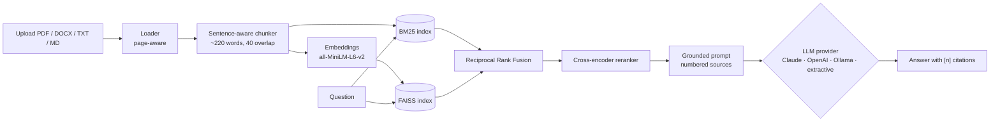

# DocuSense

Chat with your documents. Upload PDFs, Word files, text or Markdown, ask questions, and get answers that cite the exact page they came from.

Under the hood it's a full retrieval-augmented generation (RAG) pipeline in Python: hybrid BM25 + vector search, reciprocal rank fusion, cross-encoder reranking, and a pluggable LLM layer that works with **Claude, OpenAI, or a local model through Ollama**. With no API keys at all it still runs, using an offline extractive answerer.



## What's inside

| Layer | What it does | Tech |
| --- | --- | --- |
| Ingestion | Parses PDFs page by page so every answer can cite a page number. Handles DOCX tables. | pypdf, python-docx |
| Chunking | Packs whole sentences into ~220-word chunks with overlap, never splitting mid-sentence or across pages. Bullet lists keep their item boundaries. | custom |
| Keyword search | BM25 catches exact terms like product names, acronyms and IDs. | rank-bm25 |
| Semantic search | Dense embeddings catch paraphrases, e.g. "sell power back to the grid" finds the "vehicle-to-grid" section. | sentence-transformers, FAISS |
| Fusion | Reciprocal Rank Fusion merges both rankings using ranks only, so BM25 scores and cosine similarities never need to share a scale. | custom |
| Reranking | A cross-encoder reads question and passage together and reorders the shortlist. | ms-marco-MiniLM-L-6-v2 |
| Generation | A grounded prompt with numbered sources. The model must cite every claim and say so when the answer isn't there. | Claude, OpenAI, Ollama |
| API | Typed request/response models, upload validation, size limits, OpenAPI docs. | FastAPI, Pydantic |
| UI | Chat with follow-up questions, document filters, provider picker, expandable sources. | Streamlit |
| Quality | 37 offline tests, a retrieval/answer evaluation harness, CI. | pytest, ruff, GitHub Actions |

## Quick start

```bash
git clone https://github.com/Ashish-96-12/docusense.git
cd docusense
python -m venv .venv && source .venv/bin/activate
pip install -r requirements-dev.txt

cp .env.example .env        # add ANTHROPIC_API_KEY and/or OPENAI_API_KEY (optional)

make api                    # FastAPI on http://localhost:8000  (docs at /docs)
make ui                     # Streamlit on http://localhost:8501 (in a second terminal)
```

The first start downloads the embedding and reranker models (~150 MB) from Hugging Face.

### With Docker

```bash
cp .env.example .env
docker compose up --build   # API on :8000, UI on :8501
```

The image bakes the models in, so the container works offline. Documents persist in a named volume.

## Choosing an LLM

Set `DOCUSENSE_LLM_PROVIDER` in `.env`, or pick per question in the UI or the API's `provider` field.

| Provider | Needs | Default model |
| --- | --- | --- |
| `anthropic` | `ANTHROPIC_API_KEY` | `claude-sonnet-5-5` |
| `openai` | `OPENAI_API_KEY` (or any OpenAI-compatible server via `DOCUSENSE_OPENAI_BASE_URL`) | `gpt-4o-mini` |
| `ollama` | [Ollama](https://ollama.com) running locally, then `ollama pull llama3.1` | `llama3.1` |
| `extractive` | nothing | picks and cites the most relevant sentences |
| `auto` (default) | | first available of the above, in that order |

If a provider call fails (bad key, rate limit, network), the answer falls back to extractive mode and the response includes a warning, so the user still gets something grounded.

## API

| Method | Path | Purpose |
| --- | --- | --- |
| `POST` | `/documents` | Upload and index a file (multipart `file`) |
| `GET` | `/documents` | List indexed documents |
| `DELETE` | `/documents/{doc_id}` | Remove a document and its chunks |
| `POST` | `/query` | Ask a question, get a cited answer |
| `POST` | `/retrieve` | Retrieval only, no LLM (for debugging and eval) |
| `GET` | `/providers` | Which LLM providers are usable right now |
| `GET` | `/health` | Counts, embedder, reranker, default provider |

```bash
curl -F "file=@data/samples/cloud_mobility_proposal.pdf" localhost:8000/documents

curl localhost:8000/query -H "content-type: application/json" \
  -d '{"question": "Which edge AI hardware lets vehicles decide quickly?", "provider": "anthropic"}'
```

Response shape (illustrative, trimmed):

```json
{
  "answer": "NVIDIA Jetson and AWS Greengrass let vehicles make decisions at the edge without waiting on the cloud [1][2].",
  "citations": [
    {"index": 1, "filename": "cloud_mobility_proposal.pdf", "page": 4, "cited": true, "text": "..."}
  ],
  "provider": "anthropic",
  "model": "claude-sonnet-5-5",
  "latency_ms": 1840,
  "warnings": []
}
```

Follow-up questions work too: pass earlier turns in `history`, and short follow-ups are expanded with the previous question before searching.

## Evaluation

`eval/questions.jsonl` has 16 labeled questions over the sample documents: keyword-style questions, paraphrased ones that share few words with the source text, and one question the documents can't answer.

```bash
python -m eval.run_eval                       # compare bm25 / vector / hybrid
python -m eval.run_eval --provider anthropic  # score Claude's answers
```

It reports:

- **hit@k and MRR** for each retrieval mode: did a relevant chunk show up, and how high?
- **paraphrase hit rate**: the questions where keyword search should struggle
- **keyword recall**: does the answer contain the expected facts?
- **groundedness**: what share of answer sentences is supported by the retrieved sources (a cheap hallucination check)
- **refusal**: does it decline the unanswerable question instead of making something up?

Results are written to `eval/results.json`.

## Design decisions

- **Hybrid instead of vectors only.** Embeddings miss exact identifiers ("ISO 21434", "AWS Kinesis"); BM25 misses paraphrases. Fusing both covers each one's blind spot.
- **RRF instead of weighted score blending.** BM25 scores are unbounded and corpus-dependent while cosine similarity sits in [-1, 1]. Rank fusion sidesteps calibrating them against each other.
- **Rerank only the shortlist.** A cross-encoder is far more accurate but too slow to run over every chunk, so it reorders the top `3 × top_k` fused candidates.
- **Page-aware chunks.** Chunks never cross a page boundary, so every citation points to one page a user can check.
- **Small-corpus BM25 fix.** With very few chunks BM25's IDF goes to zero or negative and real matches score ≤ 0. DocuSense v1 returned nothing for any document under ~500 words because of this. v2 falls back to term overlap when that happens (there's a regression test).
- **Prompt-injection hygiene.** Sources are wrapped in a `<sources>` block and the system prompt tells the model to treat them as content, not instructions.
- **Degrades instead of crashing.** If the embedding model can't download it uses a hashing embedder, if the reranker is missing it skips reranking, and with no API key (or a failed call) it falls back to extractive answers. `/health` and the logs say which mode you're in.
- **Plain Python, no framework.** Each stage is a small module you can read in a few minutes, which makes the retrieval logic easy to inspect, test and swap out.

## Project layout

```
docusense/
  api.py              FastAPI app
  pipeline.py         retrieve, build prompt, generate, cite
  store.py            persistent knowledge base (documents, chunks, embeddings)
  prompts.py          grounded system prompt and source formatting
  config.py           settings from env / .env
  schemas.py          Pydantic models
  ingestion/          loaders and chunker
  retrieval/          BM25, FAISS, embeddings, RRF, reranker, hybrid retriever
  llm/                provider interface + Claude, OpenAI, Ollama, extractive
ui/streamlit_app.py   chat UI
eval/                 labeled questions and evaluation script
tests/                offline test suite
data/samples/         example documents
```

## Testing

```bash
make test     # 37 tests, ~6 s, fully offline
```

The suite uses a hashing embedder and a fake LLM, so it needs no network, models or API keys. It covers loaders, chunking, BM25 edge cases, fusion, reranking, document filtering, persistence, provider selection and fallback, request mapping for each SDK, and the HTTP API.

## Limitations and next steps

- Scanned PDFs need OCR first (they're rejected with a clear message).
- Indexes are rebuilt in memory after each upload. That's fine for thousands of chunks; for much more, move to a vector database like pgvector, Qdrant or Pinecone.
- Answers aren't streamed yet.
- No auth: run it locally or behind your own gateway.
